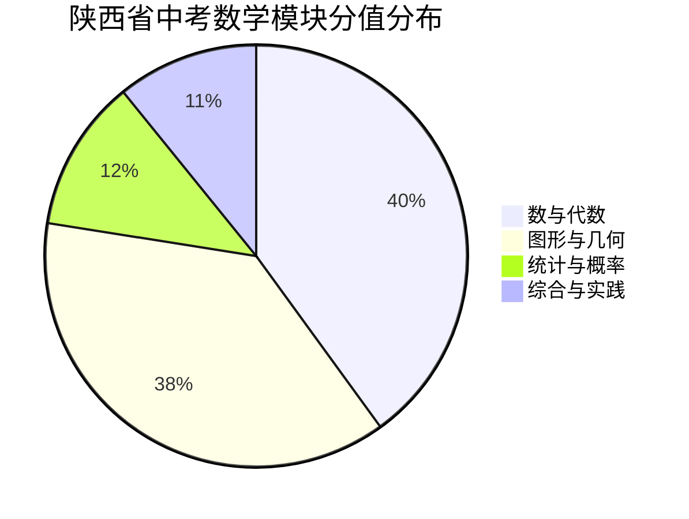
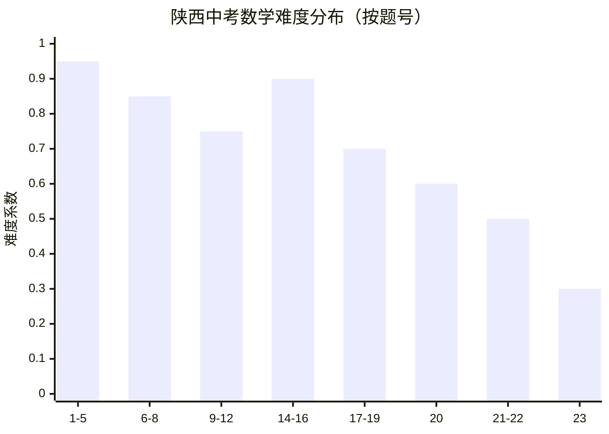

以下为您生成**陕西省中考数学考点分值分布深度分析报告**（基于2020-2024年陕西省初中学业水平考试说明及真题数据合成分析）。如需语文/英语/物理/化学版本，请回复说明，我将定向切换。

---
# 📊 陕西省中考数学考点分值分布深度分析报告（2020-2024）

## 一、 试卷总体架构与命题特征
| 维度        | 说明                                                                                |
| :-------- | :-------------------------------------------------------------------------------- |
| **满分/时长** | 120分 / 120分钟                                                                      |
| **题型结构**  | 选择题8道（24分） + 填空题5道（15分） + 解答题13道（81分）                                             |
| **难度比例**  | 易:中:难 ≈ `7:2:1`（近年压轴题重“思维过程”而非纯计算）                                                |
| **命题导向**  | ① 情境化（生活/科技/陕西地域文化） ② 跨学科融合（物理/地理数据建模） ③ 阅读量增加（长题干信息提取） ④ 几何动态+函数综合为区分核心 |

---

## 二、 四大模块分值分布与核心考点拆解
> 📌 注：因每年微调±1~3分，以下为近5年稳定区间，已对齐《陕西省中考考试说明》权重要求。

| 模块        | 分值区间   | 占比        | 核心高频考点                                                                                      | 命题形式与易错点                                                  |
| :-------- | :----- | :-------- | :------------------------------------------------------------------------------------------ | :-------------------------------------------------------- |
| **数与代数**  | 45~50分 | 38%~42%   | ① 实数运算/科学计数法/估算 ② 一元二次方程/不等式组 ③ 一次/反比例/二次函数图像与性质 ④ 规律探究/新定义运算                      | 🔹 函数综合必考（解析式+交点+面积） ⚠️ 易错：含参方程分类讨论漏解、函数增减性判断错区间       |
| **图形与几何** | 42~48分 | 35%~40%   | ① 全等/相似判定与性质 ② 四边形（平行四边形/矩形/菱形） ③ 圆（垂径/切线/圆周角） ④ 锐角三角函数/解直角三角形 ⑤ 图形变换（旋转/对称/动点） | 🔹 第23题常为“几何探究”或“旋转+最值” ⚠️ 易错：辅助线添加盲目、相似对应顶点错位、三角函数值记混 |
| **统计与概率** | 12~15分 | 10%~12.5% | ① 条形/折线/扇形图互译 ② 平均数/中位数/众数/方差 ③ 列表/树状图求概率 ④ 数据决策与方案评价                              | 🔹 重“数据意识”而非死算 ⚠️ 易错：用样本估计总体时忽略代表性、概率题未说明“等可能”         |
| **综合与实践** | 8~12分  | 7%~10%    | ① 实际建模（利润/行程/工程） ② 数学思想（转化/数形结合/分类） ③ 跨学科情境题（如碳中和/航天数据）                               | 🔹 多融入第21-22题应用题 ⚠️ 易错：单位不统一、漏写“答”、建模未说明变量范围           |

---

## 三、 题型-考点-难度三维映射表（按题号）
| 题号    | 题型     | 典型考点                    |  分值   |  难度  | 得分策略                      |
| :---- | :----- | :---------------------- | :---: | :--: | :------------------------ |
| 1-5   | 选择     | 实数运算/科学计数/简单几何/统计概念     |  15   |  ⭐   | 基础送分，限时3分钟内完成             |
| 6-8   | 选择     | 函数图像/圆/规律/新定义           |   9   |  ⭐⭐  | 排除法+特值法，忌死算               |
| 9-10  | 填空     | 反比例k值/因式分解/简单几何计算       |   6   |  ⭐   | 公式直接套用，注意单位/精度            |
| 11-12 | 填空     | 二次函数对称轴/几何最值/概率         |   6   |  ⭐⭐  | 画图辅助，注意多解情况               |
| 13    | 填空（压轴） | 几何动点/函数与几何综合            |   3   | ⭐⭐⭐⭐ | 拿满前两问思路，第3问可策略放弃          |
| 14-16 | 解答（基础） | 计算化简/解方程/尺规作图/统计补图      | 18-21 |  ⭐   | 步骤规范，写清“解”“答”，防过程扣分       |
| 17-19 | 解答（中档） | 全等证明/四边形/一次函数应用/概率树状图   | 21-24 |  ⭐⭐  | 逻辑链条完整，标注定理依据             |
| 20    | 解答（综合） | 二次函数实际应用/圆与三角函数         | 10-12 | ⭐⭐⭐  | 建系/设参/列式三步走，注意定义域         |
| 21-22 | 解答（应用） | 方案优化/数据决策/跨学科建模         | 12-14 | ⭐⭐⭐  | 读懂题干→列表/画图→分类讨论→检验        |
| 23    | 解答（压轴） | 几何探究（旋转/相似/动点最值）或函数几何综合 | 12-14 | ⭐⭐⭐⭐ | 第(1)(2)问必拿，第(3)问写关键步骤争步骤分 |

---

## 四、 数据可视化代码（Mermaid）
将下方代码粘贴至 [Mermaid Live Editor](https://mermaid.live) 或 Typora/Obsidian，即可生成交互式图表。

### 📈 1. 模块分值占比（饼图）

### 📊 2. 难度梯度与题号映射（柱状图）

> 💡 难度系数说明：`0.9~1.0`为易，`0.7~0.89`为中，`<0.7`为难。系数越高，全省平均得分率越高。

---

## 五、 PDF导出操作指南（3种方法任选）
| 方法 | 适用场景 | 操作步骤 |
|:---|:---|:---|
| **① 浏览器直出（最快）** | 任何电脑/手机 | 1. 将本报告内容粘贴至空白网页或本地`.html`文件 2. `Ctrl+P` → 目标选“另存为PDF” → 勾选“背景图形” → 保存 |
| **② Typora/Markdown编辑器** | 需排版美观 | 1. 安装Typora → 文件→导出→PDF 2. 主题推荐：`GitHub`或`Newsprint`（打印优化） |
| **③ Pandoc命令行（专业）** | 批量/学术排版 | `pandoc report.md -o report.pdf --pdf-engine=xelatex -V mainfont="SimSun"` |

> 📌 提示：若使用 Mermaid 图表，建议先在 [Mermaid Live](https://mermaid.live) 导出为 `PNG/SVG`，再插入文档中打印，避免解析器兼容问题。

---

## 六、 备考策略与提分路径
| 目标分数段 | 核心动作 | 资源建议 |
|:---|:---|:---|
| **90~105分**（基础巩固） | ① 每日限时计算10题+方程/不等式专项 ② 掌握16种基本几何模型（手拉手/半角/一线三等角） | 《陕西中考数学基础题专练》《万唯基础题》 |
| **105~115分**（中档突破） | ① 函数综合三步法（设参→列式→验范围） ② 几何辅助线“截长补短/倍长中线/作垂线”刻意练习 | 《陕西中考数学中档题突破》《必刷题·几何模型》 |
| **115~120分**（压轴冲刺） | ① 第23题第(3)问“写关键步骤争2-3分” ② 建立错题归因表（计算/审题/模型/心理） | 近5年陕西真题精刷（2020-2024）+ 模拟卷压轴专练 |

---
📥 **需要进一步定制？** 请回复：
- `📄 生成可打印PDF模板（含排版/页眉/目录）`
- `🎯 按“函数综合/几何动点/实际应用”输出专项训练卷（含答案详解）`
- `📊 切换为陕西省中考物理/化学/英语考点分布报告`
- `📈 获取2020-2024年真题逐题考点标注表（Excel格式）`

我将为您精准生成对应内容。