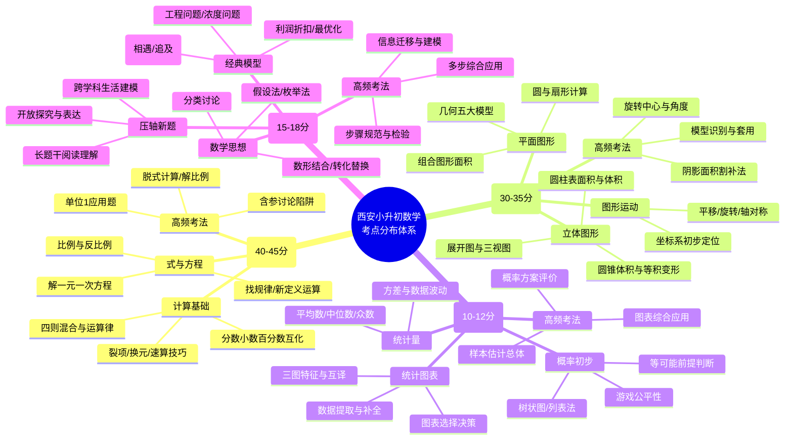

以下为您定制**纯 Markdown 格式**的《西安市小升初数学考点分值分布深度分析报告》，完全兼容 Obsidian，复制后无需任何转换即可直接渲染表格与思维导图。

---
# 📊 西安市小升初数学考点分值分布深度分析报告
> **数据说明**：自2019年“公民同招”后，西安无官方统一选拔笔试。本报告基于 `2015-2018年各区真题` + `近年新初一分班考` + `学业质量监测卷` 命题规律合成分析，反映当前实际教学评价标准，满分通常按 `100分/90分钟` 统计。

## 一、 四大模块分值分布与核心考点速查
| 模块        | 分值区间   | 占比      | 核心高频考点                                                   | 高频题型/考法                                 | 西安卷特色 & 易错点                                                      | 备考优先级 |
| :-------- | :----- | :------ | :------------------------------------------------------- | :-------------------------------------- | :--------------------------------------------------------------- | :---- |
| **数与代数**  | 40~45分 | 40%~45% | ① 分数/小数/百分数互化 ② 四则混合与运算律（裂项/换元/分配律逆用） ③ 解方程/比例/找规律 | • 脱式计算/解方程 • 比例应用题 • 新定义运算填空      | 🔹 计算基本功要求极高 ⚠️ 易错：单位“1”切换错误、比例尺换算漏倍率、含参方程未分类讨论               | ⭐⭐⭐⭐⭐ |
| **图形与几何** | 30~35分 | 30%~35% | ① 组合图形面积（割补/等积/容斥） ② 圆与扇形计算 ③ 圆柱圆锥体积 ④ 图形变换/三视图 | • 阴影面积计算 • 展开图折叠/旋转作图 • 几何模型识别    | 🔹 几何占比偏高，重“模型化”（鸟头/蝴蝶/燕尾/一半模型） ⚠️ 易错：圆锥漏×1/3、旋转中心标错、割补边界重叠漏算 | ⭐⭐⭐⭐⭐ |
| **统计与概率** | 10~12分 | 10%~12% | ① 条形/折线/扇形图特征与互译 ② 平均数/中位数/众数/方差 ③ 列表/树状图求概率       | • 图表信息提取与补全 • 数据决策/方案评价 • 游戏公平性判断 | 🔹 重“数据意识”而非死算 ⚠️ 易错：扇形图百分比直接比较实际量、概率题未说明“等可能”前提              | ⭐⭐⭐   |
| **综合与实践** | 15~18分 | 15%~18% | ① 行程/工程/浓度/利润问题 ② 鸡兔同笼/盈亏/最优化 ③ 跨学科情境建模            | • 长题干阅读理解题 • 多步综合应用题 • 开放探究/规律发现  | 🔹 压轴题集中区，重“建模与分类讨论” ⚠️ 易错：漏设未知数、单位不统一、未检验合理性、漏写答句            | ⭐⭐⭐⭐  |

---

## 二、 题型-考点-难度映射表（按卷面结构）
| 题型 | 题量/分值 | 典型考点 | 难度 | 得分策略 |
|:---|:---:|:---|:---:|:---|
| **选择题** | 6题 / 12分 | 概念辨析/估算/简单几何/统计特征 | ⭐ | 排除法+特值代入，限时5分钟内完成 |
| **填空题** | 8题 / 16分 | 计算结果/比例反推/图形计算/找规律 | ⭐~⭐⭐ | 注意单位/精度，第7-8题常设“多解/陷阱” |
| **计算题** | 3题 / 18分 | 直接计算/脱式简算/解方程 | ⭐ | 步骤写清“原式=”，草稿纸分区防抄错 |
| **图形题** | 2题 / 12分 | 阴影面积/展开图/旋转作图/三视图 | ⭐⭐ | 标注辅助线，写出“公式→代入→结果”过程 |
| **应用题** | 4题 / 28分 | 行程/工程/利润/比例分配/综合 | ⭐⭐⭐ | 画线段图/列表→设元→列式→检验→规范作答 |
| **压轴/创新** | 1~2题 / 14分 | 新定义/阅读理解/多步几何/最值 | ⭐⭐⭐⭐ | 第1小问必拿满分，第2问写关键推导争步骤分 |

---

## 三、 知识体系思维导图（Obsidian 原生渲染）

---

## 四、 西安特色备考策略（按目标分数段）
| 目标区间                   | 核心提分动作                                             | 推荐训练路径                    |
| :--------------------- | :------------------------------------------------- | :------------------------ |
| **80~88分** *(基础稳)*  | ① 每日10分钟限时计算（准确率≥95%） ② 熟记12个核心几何公式与3大比例模型      | 《西安小升初计算通关》+ 北师大版基础卷限时刷   |
| **88~95分** *(中档破)*  | ① 行程/工程问题“画线段图+设元”标准化 ② 几何割补/等积变形专项突破（每天1道精做）   | 《高思竞赛课本》+ 分班考真题几何模块专练     |
| **95~100分** *(拔高冲)* | ① 压轴题“保1争2”策略（写清关键推导步骤） ② 长题干信息提取训练（圈画关键词/列条件表） | 近5年高新区/碑林区监测卷 + 《小升初培优压轴》 |

---

## 📥 Obsidian 使用与导出指南
1. **直接粘贴**：新建笔记 → 粘贴本内容 → Obsidian 会自动渲染表格与 Mermaid 思维导图
2. **导出 PDF**：
   - 打开笔记 → 点击右上角 `⋯` → `导出为 PDF`（需安装官方插件或社区插件 `Export to PDF`）
   - 或使用命令行：`obsidian://export?file=你的笔记名.md`（配合 Pandoc 效果更佳）
3. **思维导图交互**：Obsidian 原生支持 Mermaid，点击导图节点可折叠/展开，支持右键 `Export as SVG/PNG`
4. **排版优化**：若表格换行异常，可在 Obsidian 设置 → `编辑器` → 开启 `严格模式` 或调整 `Markdown 表格对齐`

---
📌 **需要进一步定制？** 请回复：
- `📄 输出带真题标注的《高频错题本》Markdown 模板`
- `🎯 按“几何模型/行程问题/新定义运算”生成专项训练卷（含答案）`
- `📊 切换为语文/英语/小升初科学考点分布报告`

我将按相同纯 Markdown 格式为您定向生成。