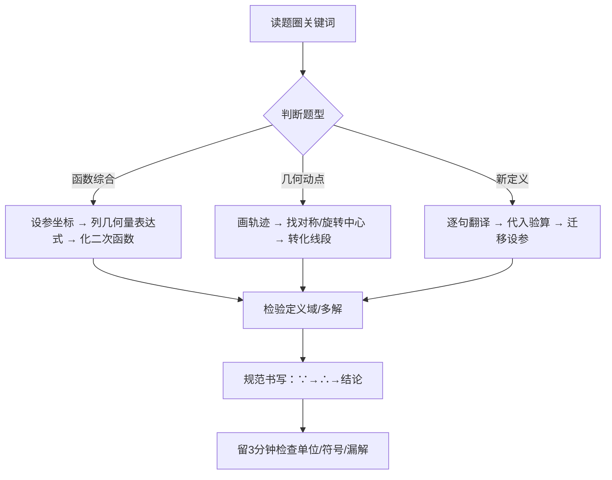

以下为您整合生成的三份**不分册、按模块/题型归类**的中考数学核心资料。全文采用纯 Markdown 编写，已适配 Obsidian 原生渲染（含 Callout 提示块、KaTeX 公式、表格与标签），复制后粘贴即可直接使用。

---

# 📘 模块一：《核心公式与定理速查表》
> `#核心公式 #速查表 #北师大版初中数学 #中考数学`

### 🔢 数与代数 / 方程与不等式
| 类别           | 公式/定理                                                  | 适用条件/备注                           |
| :----------- | :----------------------------------------------------- | :-------------------------------- |
| **乘法公式**     | $(a\pm b)^2=a^2\pm2ab+b^2$ $(a+b)(a-b)=a^2-b^2$     | 逆用即因式分解；注意符号与系数平方                 |
| **一元二次方程求根** | $x=\frac{-b\pm\sqrt{b^2-4ac}}{2a}$ $\Delta=b^2-4ac$ | $\Delta>0$ 两不等实根；$=0$ 等根；$<0$ 无实根 |
| **韦达定理**     | $x_1+x_2=-\frac{b}{a},\quad x_1x_2=\frac{c}{a}$        | 仅适用于实系数且 $\Delta\ge0$；常用于对称式求值    |
| **不等式性质**    | 两边乘/除负数，不等号方向改变                                        | 解集在数轴上：实心点含等号，空心点不含               |
| **分式基本性质**   | $\frac{A}{B}=\frac{A\cdot M}{B\cdot M}\ (M\neq0)$      | 解分式方程**必须验根**（分母≠0）               |

### 📈 函数
| 类别 | 解析式/性质 | 关键参数意义 |
|:---|:---|:---|
| **一次函数** | $y=kx+b\ (k\neq0)$ | $k$ 定斜率与增减性；$b$ 为 $y$ 轴截距 |
| **反比例函数** | $y=\frac{k}{x}\ (k\neq0)$ | $|k|$ 为矩形面积；$k>0$ 在一三象限，$k<0$ 在二四象限 |
| **二次函数** | 一般式：$y=ax^2+bx+c$ 顶点式：$y=a(x-h)^2+k$ 交点式：$y=a(x-x_1)(x-x_2)$ | 对称轴 $x=-\frac{b}{2a}=h$ 顶点 $(h,k)$ $a>0$ 开口向上有最小值 |

### 📐 平面几何 / 三角形 / 四边形
| 类别 | 定理/公式 | 核心结论 |
|:---|:---|:---|
| **全等判定** | SSS, SAS, ASA, AAS, HL(直角) | 对应边/角相等；面积/周长/高/中线均相等 |
| **相似判定** | AA, SAS(两边成比例夹角等), SSS(三边成比例) | 相似比 $k$：周长比 $=k$，面积比 $=k^2$ |
| **勾股定理** | $a^2+b^2=c^2$（直角三角形） | 逆定理可证直角；常用勾股数 $(3,4,5),(5,12,13),(8,15,17)$ |
| **三角形中位线** | 平行于第三边，且等于第三边一半 | 构造中点/平行四边形的核心工具 |
| **特殊四边形** | 平行四边形→矩形(一角直角/对角线等) →菱形(邻边等/对角线垂直) →正方形(矩形+菱形) | 判定与性质互逆；对角线互相平分是基础 |

### 🔵 圆与解直角三角形
| 类别 | 定理/公式 | 备注 |
|:---|:---|:---|
| **垂径定理** | 垂直于弦的直径平分弦，且平分弦所对的两条弧 | 知二推三；常作“弦心距”构造直角三角形 |
| **圆周角定理** | 同弧所对圆周角 $=$ 圆心角的一半；直径所对圆周角 $=90^\circ$ | 找等角/证垂直的核心 |
| **切线判定** | 过半径外端且垂直于该半径的直线是切线 | 证切线：**连半径，证垂直** |
| **弧长与扇形面积** | $l=\frac{n\pi r}{180}$ $S_{\text{扇}}=\frac{n\pi r^2}{360}=\frac{1}{2}lr$ | $n$ 为圆心角度数；注意单位统一 |
| **锐角三角函数** | $\sin A=\frac{\text{对}}{\text{斜}},\ \cos A=\frac{\text{邻}}{\text{斜}},\ \tan A=\frac{\text{对}}{\text{邻}}$ | $0^\circ<\angle A<90^\circ$ 时，$\sin/\tan$ 随角增大而增大，$\cos$ 减小 |

### 📊 统计与概率
| 类别 | 公式/概念 | 说明 |
|:---|:---|:---|
| **方差** | $s^2=\frac{1}{n}\sum_{i=1}^n(x_i-\bar{x})^2$ | 方差越小，数据越稳定；受极端值影响大 |
| **古典概型** | $P(A)=\frac{m}{n}$ | 前提：所有结果等可能；$m$ 为有利结果数 |
| **频率估计概率** | 大量重复试验中，频率稳定于概率 | 试验次数越多，估计越准确 |

---

# 📙 模块二：《易错点与典型陷阱清单》
> `#易错清单 #避坑指南 #中考提分 #错题归因`

> [!warning] 高频失分预警
> 中考阅卷实行“按步给分”，以下陷阱一旦触发，常导致整题步骤分清零。

| 模块 | 典型陷阱 | 错误表现 | 避坑策略/口诀 |
|:---|:---|:---|:---|
| **代数运算** | 负号分配遗漏 | $-(a-b)= -a-b$ ❌ | **括号前负号，进去全变号** |
| | 二次根式化简 | $\sqrt{a^2}=a$ ❌（未考虑 $a<0$） | **$\sqrt{a^2}=|a|$，先判符号再去绝对值** |
| | 分式方程 | 解出 $x=2$ 直接写答 | **解分式必验根，分母为零即增根** |
| **不等式** | 乘除负数 | $-2x>4 \Rightarrow x> -2$ ❌ | **乘除负，方向反；画数轴，定区间** |
| | 忽略隐含条件 | 应用题未写 $x\in\mathbb{Z}^+$ 或范围 | **实际量必标范围，整数/非负先圈出** |
| **函数** | 定义域遗漏 | 二次函数应用题未写自变量范围 | **实际问题带背景，定义域先写清** |
| | $k$ 的符号陷阱 | 反比例 $y=\frac{k}{x}$ 过二四象限却写 $k>0$ | **象限定 $k$ 号，一三正，二四负** |
| | 二次函数最值 | 顶点不在区间内直接代顶点 | **最值看区间：端点优先，顶点次之** |
| **几何证明** | 相似对应错位 | $\triangle ABC\sim\triangle DEF$ 但写 $AB/DE=BC/DF$ | **字母顺序定对应，对应边比才相等** |
| | 圆中漏情况 | 求弦长/圆周角未分同弧/优弧 | **弦对两角互补；直径必连90°** |
| | 切线证明跳步 | 未“连半径”直接写垂直 | **证切线三步：连半径→证垂直→下结论** |
| **动点/分类** | 等腰/直角漏解 | 只算一种情况直接作答 | **等腰分底腰，直角分顶点；画图标清防遗漏** |
| | 动点范围超限 | 算出 $t=5$ 但题干 $0<t\le4$ | **解完先对范围，超限立刻舍** |
| **统计概率** | 频率≠概率 | “掷骰子3次出现2次6，故概率为2/3” | **概率是理论值，频率是试验值，不可混用** |
| | 概率前提缺失 | 未说明“等可能”直接列式 | **古典概型必写：∵所有结果等可能，∴…** |

---

# 📕 模块三：《中考压轴题母题拆解模板》
> `#母题拆解 #压轴题SOP #二次函数综合 #几何最值 #新定义`

> [!tip] 压轴题得分逻辑
> 中考第23/24/25题通常设3问：`第(1)问送分(3~4分)` → `第(2)问中档(5~6分)` → `第(3)问探究(6~8分)`。**策略：保1稳2争3，步骤写清即拿分。**

### 🧩 母题一：二次函数与几何综合（存在性/面积/平移）
| 维度 | 拆解模板 |
|:---|:---|
| **题干特征** | 抛物线过定点/交坐标轴，动点在抛物线上，求面积最值/平行四边形存在性/相似三角形存在性 |
| **第(1)问** | 待定系数法求解析式（代入已知点列方程组）→ **必拿** |
| **第(2)问** | **面积最值**：铅垂高×水平宽÷2 → 转化为二次函数求顶点 **存在性**：设动点坐标，利用向量/中点公式/距离公式列方程 → 分类讨论 |
| **第(3)问** | **平移/翻折/旋转**：利用“对应点坐标变换规律”或“全等/相似转化” **关键模型**：$S_{\triangle}=\frac{1}{2}\|x_1-x_2\|\cdot\|y_P-y_{\text{线}}\|$ |
| **变式方向** | 面积等分线、定角定高、阿氏圆、胡不归 |

### 🧩 母题二：几何动点与最值问题（将军饮马/旋转缩放）
| 维度 | 拆解模板 |
|:---|:---|
| **题干特征** | 定点+动点+定直线/圆，求线段和最小/差最大/路径最短 |
| **第(1)问** | 基础几何证明（全等/相似/特殊四边形）→ **写清判定依据** |
| **第(2)问** | **单动点最值**：两点之间线段最短（对称翻折） **双动点**：平移+对称（造平行四边形） **圆上动点**：连接圆心与定点（三角形三边关系） |
| **第(3)问** | **隐圆问题**：定弦定角→轨迹为圆弧；直角→直径为弦 **旋转模型**：手拉手/半角模型→构造全等转移线段 |
| **关键口诀** | `同侧对称，异侧直连；定角定弦，轨迹是圆；旋转转移，等长代换` |

### 🧩 母题三：新定义/阅读理解型探究
| 维度 | 拆解模板 |
|:---|:---|
| **题干特征** | 给出新概念（如“伴随点”“和谐数”“旋转变换”），要求理解后应用或推广 |
| **第(1)问** | **直接套用**：按定义代入计算 → **送分，不可丢** |
| **第(2)问** | **逆向求解**：已知结果反推参数，列方程/不等式组 |
| **第(3)问** | **迁移推广**：将定义与函数/几何结合，设参分类，写出推导链条 |
| **破题三步** | ① 圈出定义中的`条件句`与`结论句` ② 画出`符号语言`翻译对照表 ③ 第3问必写`“由定义可知…设…分情况讨论…”` |

### 🛠️ 压轴题通用 SOP（考场实操流程）

> [!danger] 步骤分抢夺技巧
> - 即使不会第3问，写出 `“设点P坐标为…”`、`“由题意得方程…”`、`“分两种情况讨论…”` 可拿 `2~3分`
> - 几何证明**跳步不扣分**，但**逻辑断裂扣2分**，务必写清 `∵…(定理)…，∴…`
> - 计算过程保留 `2位小数` 或 `根号形式`，除非题干要求精确值

---

## 💡 Obsidian 高效使用指南
1. **折叠管理**：为每个模块添加 `> [!note]- 点击展开` 语法，复习时一键隐藏，避免信息过载
2. **错题直链**：在错题笔记中使用 `[[易错点#分式方程]]` 或 `[[母题拆解#将军饮马]]`，点击即可跳转对应避坑策略
3. **标签检索**：配合 `#二次函数 #几何最值 #分类讨论` 等标签，用 Obsidian 搜索栏快速定位薄弱模块
4. **导出打印**：`文件 → 导出为 PDF` → 勾选 `包含标签` 与 `背景图形`，排版将保持 Callout 色块与表格完整

如需将本内容转换为 **可填空自测版（隐藏答案）**、**Anki 记忆卡片格式** 或 **配套真题标注清单**，请回复具体需求，我将按相同规范为您生成。